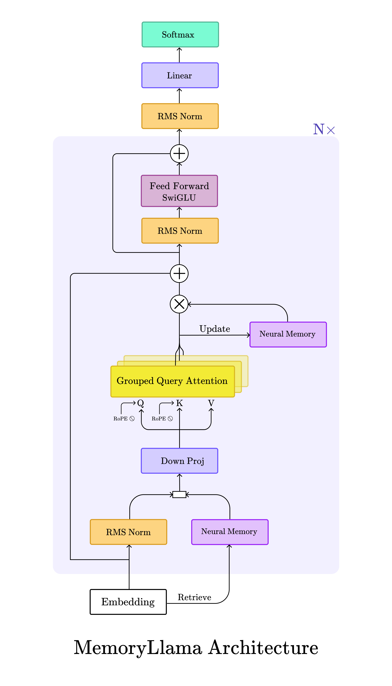

# `Hercules`: Neural Memory Augmentation for Large Language Models

Source code for the MSc project **"Neural Memory Augmentation for Large Language Models"** by Ryan Pégoud at University College London.

## 🧠 Abstract


A fundamental constraint of Large Language Models (LLMs) is their fixed context window, limiting their ability to perform tasks requiring long-range memory and reasoning. While various methods attempt to scale the context window by making the attention mechanism more efficient, equipping LLMs with dedicated, online-learning memory systems represents a more scalable and cognitively-plausible paradigm.

This thesis introduces [`MemoryLlama`](https://github.com/RPegoud/Hercules/blob/main/hercules/memory_llama.py), a novel architecture that integrates a test-time trainable memory module, inspired by the Titans model, into a pre-trained Llama-3 foundation model. We investigate several architectural injection strategies and adapt Parameter-Efficient Fine-Tuning (PEFT) methods to co-train the memory and backbone components.

Empirical evaluation reveals that memory injection is highly sensitive to training dynamics and hyperparameters. Despite displaying promising initial use of the memory modules, both architectural variants ultimately suffered catastrophic forgetting. Analysis of training metrics and ablation studies suggest that this instability arises when our LLM is jointly fine-tuned with the memory modules, while at the same time being a requirement for performance.

Beyond MemoryLlama itself, this thesis contributes a rigorous characterisation of the challenges of training such hybrid models. By providing a diagnostic framework, a detailed analysis of failure modes, and directions for future research, it offers insights for building more robust and capable memory-augmented LLMs.

##  🌍 Python Environment


This project uses `uv` as a package manager. To get started, install uv and the virtual environment.
```bash
pip install uv
uv venv
uv pip install -r requirements.txt
```

Make sure to log in to `wandb` to track training and testing metrics.

```bash
wandb login
```

## 🧪 Configuration and Experiments

To launch an experiment, set the hyperparameters in `hercules/config/memory_llama.yaml`. The baseline parameters used in the thesis are:

```yaml
experiment:
  name: "eduweb_pt"
  seed: 0
  epochs: 1
  eduweb_train_batch_size: 4
  eduweb_val_batch_size: 4
  babilong_test_batch_size: 1 # B=1 prevents information leaking through memory

  gradient_accumulation_steps: 4
  learning_rate: 1e-3
  weight_decay: 0.1
  scheduler: "constant" # ["constant", "cosine"]

  num_train_samples: 5e4 # number of eduweb samples used for training
  num_val_samples: 100 # number of samples used to compute the average validation loss
  num_eval: 50 # number of evaluations during training
  num_test_samples: 100 # number of Babilong test samples per split (there are 10 splits in total)
  max_train_seq_len: 2048 # maximum sequence length of training samples

  train_task_name: "2k" # the maximal sequence length of the Babilong samples
  test_task_name: "2k"
  train_splits: ~ # Babilong splits used in training, ~ means Babilong is not used for training
  test_splits: "all" # Babilong splits used in testing
  eval_with_generate: true # whether to evaluate the model performance with `.generate()`
  max_gen_tokens: 25 # maximum number of tokens generated for evaluation

  save_every: 100 # frequency of checkpoints
  save_recent_n: 3 # the number of recent checkpoints to save
  log_experiment: false # whether to log the experiment with wandb
  resume_from_checkpoint: true # whether to load an existing model checkpoint
  checkpoint_name: ~ # path to a checkpoint folder
  resume_from_step: ~ # step to restart training from

  run_name: ~ # set the wandb run name

neural_memory:
  mlp_depth: 3 # number of hidden layers
  mlp_expansion_factor: 2 # size of the hidden layers relative to the input size
  max_adaptive_lr: 1e-2 # maximum adaptive learning rate

memory_llama:
  memory_arch: "context" # the titans architecture to inject, one of ["layer", "context"]
  llama_hf_path: "meta-llama/Llama-3.2-1B"
  memory_layer_id: [14, 15] # the index of the layer to augment with a memory module, ALMA = [14, 15]; ELMA = [1, 2]
  use_lora: true
  track_memory_statistics: true
  
lora:
  lora_rank: 16        # rank of the LoRA matrices.
  lora_alpha: 32       # scaling factor for the LoRA weights.
  lora_dropout: 0.05
  lora_target_modules: # modules to wrap with LoRA adapaters
    - "q_proj"
    - "v_proj"
    - "k_proj"
    - "o_proj"
    - "gate_proj"
    - "down_proj"
    - "up_proj"
```

## 🏃‍♂️ Running Experiments and Baselines

To run experiments and baselines, use the `Make` commands in `./makefile`:

```bash
make pt_ew # pre-training of MemoryLlama on eduweb and evaluation on BabiLong ("ALMA"/"ELMA")
make baseline # evaluation of Llama-3.2-1B on BabiLong ("Baseline")
make baseline-ft # fine-tuning of Llama-3.2-1B on eduweb and evaluation on BabiLong ("Baseline + fine-tuning")
make memory_llama_no_ft # evaluation of MemoryLlama on BabiLong ("no fine-tuning" ablation)
```

## 🏗️ Future Work:
- The parallel update rule (Eq. 16/17 in [Titans](https://arxiv.org/abs/2501.00663)) is still an experimental feature and hasn't been tested properly yet.
- MemoryLlama should be further optimised to reduce the cost of experiments (e.g., LigerKernel wrapper for Llama, Triton kernel for the memory network update rule)
- The framework should be extended to other model families, starting with smaller models (e.g. Qwen-3-0.6B, Gemma-3-270M).

## 💡 Related Work

```bibtex
@article{behrouz2024titans,
  title={Titans: Learning to memorize at test time},
  author={Behrouz, Ali and Zhong, Peilin and Mirrokni, Vahab},
  journal={arXiv preprint arXiv:2501.00663},
  year={2024}
}
```